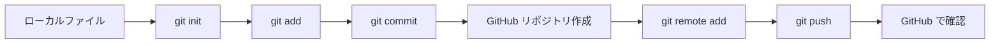

# 🚀 ターミナルからGitHubプッシュ完全ガイド
**AI Education Assistant #8 + AI Engineer #9 担当領域**

## 🎯 学習目標
- ローカルファイルをGitHubにプッシュする全プロセスを理解
- 様々な操作パターンを実践
- トラブル対応方法を習得
- 実務で使える操作技術を身につける

---

## 📋 全体フロー概要



---

## 🛠️ シナリオ別実践ガイド

### 📁 シナリオ1: 新しいプロジェクトを GitHub にアップロード

#### ステップ1: ローカルプロジェクトの準備

```bash
# 新しいディレクトリ作成
mkdir my-awesome-project
cd my-awesome-project

# プロジェクトファイル作成
echo "# My Awesome Project" > README.md
echo "console.log('Hello World!');" > app.js

# ディレクトリ構造確認
ls -la
```

#### ステップ2: Gitリポジトリとして初期化

```bash
# Gitリポジトリとして初期化
git init

# 初期化確認
ls -la  # .gitディレクトリができているか確認
```

#### ステップ3: ファイルをステージング・コミット

```bash
# 現在の状態確認
git status

# 全ファイルをステージング
git add .

# ステージング状態確認
git status

# 初回コミット
git commit -m "🎉 Initial commit: Add README and basic app"

# コミット履歴確認
git log --oneline
```

#### ステップ4: GitHub でリポジトリ作成

**GitHubウェブサイトで操作:**
1. https://github.com にアクセス
2. 右上の「+」→「New repository」
3. Repository name: `my-awesome-project`
4. Description: プロジェクトの説明
5. **重要**: 「Add a README file」はチェックしない（既にローカルにあるため）
6. 「Create repository」をクリック

#### ステップ5: リモートリポジトリを追加

```bash
# リモートリポジトリを追加
git remote add origin https://github.com/YOUR_USERNAME/my-awesome-project.git

# リモート確認
git remote -v

# ブランチ名をmainに変更（最新のGitHub標準）
git branch -M main
```

#### ステップ6: GitHub にプッシュ

```bash
# 初回プッシュ（アップストリーム設定付き）
git push -u origin main

# プッシュ結果確認
# GitHub のリポジトリページでファイルが表示されるか確認
```

---

### 📝 シナリオ2: 既存ファイルを更新してプッシュ

#### ファイル更新

```bash
# ファイル更新
echo "## 新機能追加" >> README.md
echo "const newFeature = () => console.log('New feature!');" >> app.js

# 新しいファイル追加
echo "body { font-family: Arial; }" > styles.css
```

#### 変更確認・プッシュ

```bash
# 変更内容確認
git status
git diff

# 特定ファイルのみステージング
git add README.md
git add app.js

# 新しいファイルもステージング
git add styles.css

# または全てまとめて
# git add .

# ステージング状態確認
git status

# コミット
git commit -m "✨ Add new feature and styles"

# プッシュ（2回目以降は簡単）
git push
```

---

### 🌿 シナリオ3: ブランチを使った開発フロー

#### 新機能ブランチ作成

```bash
# 現在のブランチ確認
git branch

# 新しいブランチ作成・移動
git checkout -b feature/user-login

# ブランチ確認
git branch

# 機能開発
echo "function login(user) { /* login logic */ }" > login.js
echo "# ログイン機能" > docs/login.md
```

#### ブランチでの開発・プッシュ

```bash
# 変更をコミット
git add .
git commit -m "🔐 Add user login functionality"

# 機能ブランチをプッシュ
git push -u origin feature/user-login

# GitHub でブランチが作成されているか確認
```

#### メインブランチにマージ

```bash
# メインブランチに戻る
git checkout main

# 最新版を取得
git pull origin main

# 機能ブランチをマージ
git merge feature/user-login

# マージ結果をプッシュ
git push origin main

# 不要なブランチを削除
git branch -d feature/user-login

# リモートブランチも削除
git push origin --delete feature/user-login
```

---

### 🔄 シナリオ4: チーム開発での協力フロー

#### リモートから最新版取得

```bash
# 作業前に必ず最新版を取得
git pull origin main

# または詳細に確認したい場合
git fetch origin
git log --oneline main..origin/main  # リモートの新しいコミット確認
git merge origin/main
```

#### コンフリクト解決

```bash
# コンフリクトが発生した場合
git status  # コンフリクトファイル確認

# ファイルを手動で編集してコンフリクト解決
# <<<<<<< HEAD
# あなたの変更
# =======
# 他の人の変更
# >>>>>>> commit-hash

# 解決後
git add .
git commit -m "🔀 Resolve merge conflicts"
git push
```

---

### 🏷️ シナリオ5: タグとリリース管理

#### バージョンタグ作成

```bash
# 軽量タグ作成
git tag v1.0.0

# 注釈付きタグ作成（推奨）
git tag -a v1.0.0 -m "🎉 Version 1.0.0 - Initial release"

# タグ一覧確認
git tag

# タグをプッシュ
git push origin v1.0.0

# 全タグをプッシュ
git push origin --tags
```

---

### 🔧 シナリオ6: 実用的な操作テクニック

#### 複数ファイルの選択的ステージング

```bash
# 特定の拡張子のみステージング
git add "*.js"

# 特定ディレクトリのみ
git add src/

# インタラクティブステージング
git add -i

# パッチ単位でのステージング
git add -p filename.js
```

#### コミットメッセージのベストプラクティス

```bash
# 良いコミットメッセージの例
git commit -m "✨ feat: Add user authentication system

- Implement login/logout functionality
- Add password encryption
- Create user session management
- Add input validation

Closes #123"

# 絵文字付きコミット（視認性向上）
git commit -m "🐛 fix: Resolve login button styling issue"
git commit -m "📚 docs: Update API documentation"
git commit -m "🔥 remove: Delete deprecated functions"
```

#### 履歴の美しい表示

```bash
# 美しいログ表示
git log --oneline --graph --decorate

# より詳細な履歴
git log --pretty=format:"%h %ad | %s%d [%an]" --graph --date=short

# ファイル変更履歴
git log --follow --patch -- filename.js
```

---

### 🆘 シナリオ7: よくあるトラブルと解決方法

#### プッシュが拒否された場合

```bash
# エラーメッセージ: "Updates were rejected"
# 解決方法1: pull してからpush
git pull origin main
git push origin main

# 解決方法2: リベースしてからpush
git pull --rebase origin main
git push origin main

# 緊急時のforce push（危険！使用は慎重に）
# git push --force origin main
```

#### 間違ったコミットの修正

```bash
# 最新コミットのメッセージ修正
git commit --amend -m "🔧 Fix: Correct commit message"

# ファイルを追加し忘れた場合
git add forgotten-file.js
git commit --amend --no-edit

# コミットを取り消し（ファイル変更は保持）
git reset --soft HEAD~1

# コミットを完全に取り消し（危険！）
# git reset --hard HEAD~1
```

#### ファイルを間違って追跡してしまった場合

```bash
# .gitignore に追加
echo "secret.txt" >> .gitignore
echo "node_modules/" >> .gitignore

# 既に追跡されているファイルを停止
git rm --cached secret.txt

# ディレクトリの場合
git rm -r --cached node_modules/

# 変更をコミット
git commit -m "🙈 Add gitignore and remove sensitive files"
```

---

## 🎯 実践演習チェックリスト

### ✅ 基礎レベル
- [ ] 新しいプロジェクトをGitHubにアップロード
- [ ] ファイルを更新してプッシュ
- [ ] .gitignore を設定
- [ ] コミット履歴を確認

### ✅ 中級レベル  
- [ ] ブランチを作成して機能開発
- [ ] ブランチをマージ
- [ ] コンフリクトを解決
- [ ] タグを作成・プッシュ

### ✅ 上級レベル
- [ ] インタラクティブステージング使用
- [ ] コミットを修正
- [ ] リベースを実行
- [ ] Cherry-pick を実行

---

## 📋 コマンド早見表

### 🚀 よく使うプッシュ関連コマンド

| コマンド | 説明 | 使用頻度 |
|---------|------|----------|
| `git add .` | 全変更をステージング | ⭐⭐⭐⭐⭐ |
| `git commit -m "message"` | コミット作成 | ⭐⭐⭐⭐⭐ |
| `git push` | プッシュ | ⭐⭐⭐⭐⭐ |
| `git push -u origin main` | 初回プッシュ | ⭐⭐⭐⭐ |
| `git status` | 状態確認 | ⭐⭐⭐⭐⭐ |
| `git pull` | 最新版取得 | ⭐⭐⭐⭐ |
| `git branch` | ブランチ操作 | ⭐⭐⭐ |
| `git merge` | マージ | ⭐⭐⭐ |

### 🛠️ 設定・管理コマンド

| コマンド | 説明 |
|---------|------|
| `git remote -v` | リモート確認 |
| `git log --oneline` | コミット履歴 |
| `git diff` | 変更差分表示 |
| `git tag` | タグ一覧 |
| `git branch -a` | 全ブランチ表示 |

---

## 🎓 次のステップ

### 📚 さらに学びたい方へ
1. **GitHub Actions**: 自動化・CI/CD
2. **GitHub Pages**: 静的サイトホスティング  
3. **GitHub Projects**: プロジェクト管理
4. **Git hooks**: カスタム自動化
5. **Advanced Git**: rebase, bisect, submodules

### 🔗 関連リソース
- [Git公式ドキュメント](https://git-scm.com/doc)
- [GitHub Skills](https://skills.github.com/)
- [プルリクエストガイド](./pull-request-guide.md)
- [ブランチ戦略](./branching-strategies.md)

---

💡 **AI Education Assistant による学習支援**
- 個別学習パス設定・進捗管理
- インタラクティブな演習問題生成  
- 実践的なプロジェクト提案・指導